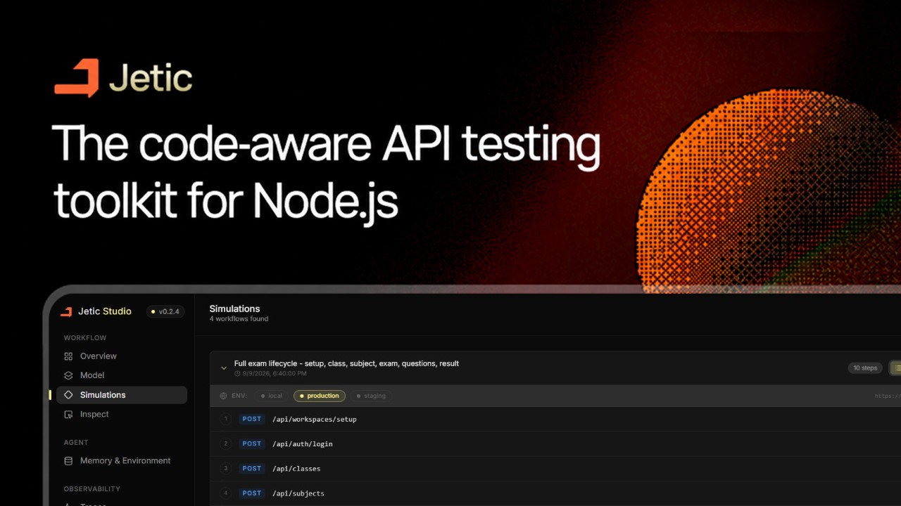
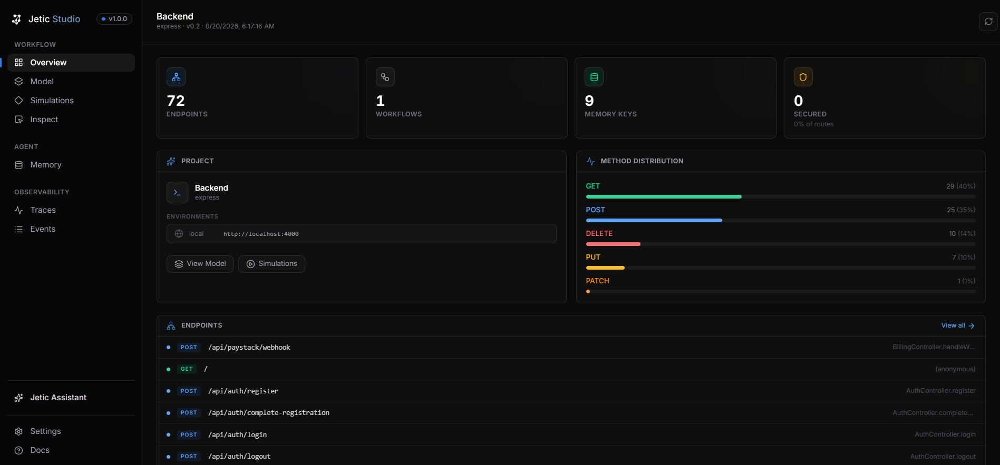
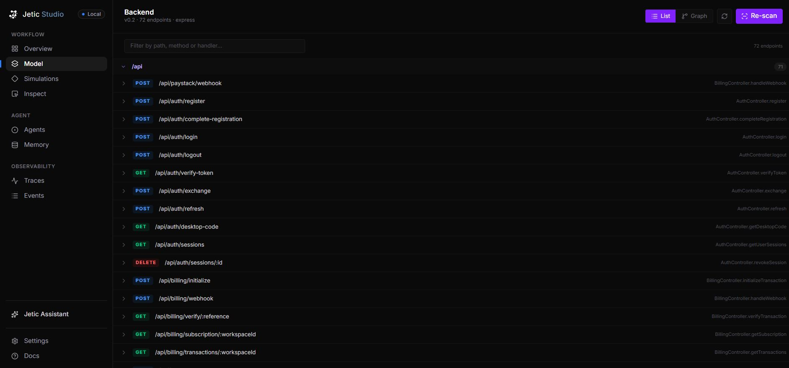
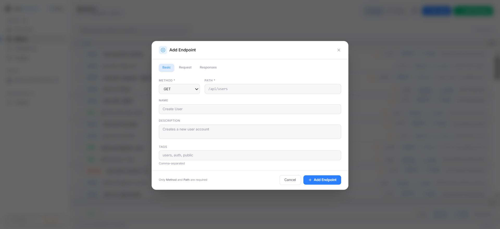
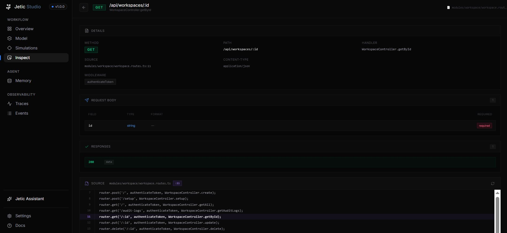
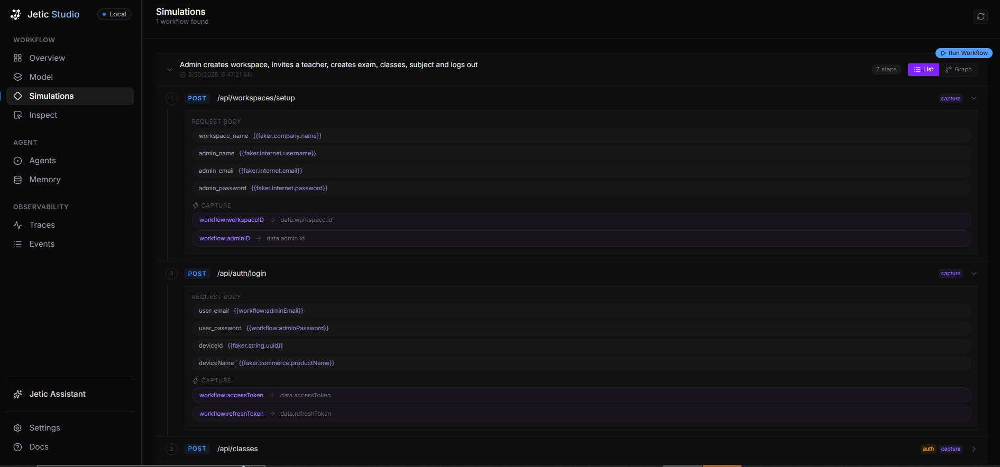
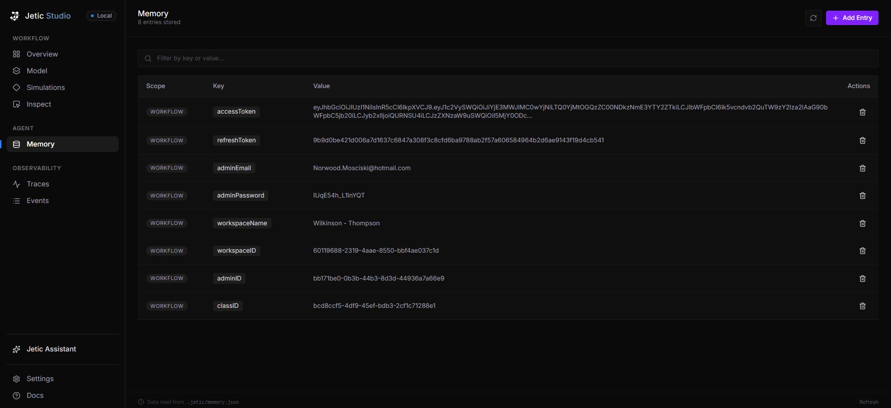
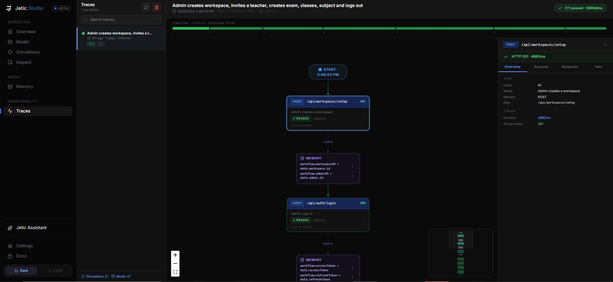

<div align="center">



<br/>
<p align="center">
  <a href="https://www.npmjs.com/package/jetic-cli"><picture><source media="(prefers-color-scheme: dark)" srcset="https://shieldcn.dev/npm/c15t.svg?variant=outline&size=xs&mode=dark"></picture></a>
  <a href="https://github.com/jeticlabs/Jetic/blob/main/LICENSE.md"><picture><source media="(prefers-color-scheme: dark)" srcset="https://shieldcn.dev/github/c15t/c15t/license.svg?variant=outline&size=xs&mode=dark"></picture></a>
  <a href="https://c15t.link/discord"><picture><source media="(prefers-color-scheme: dark)" srcset="https://shieldcn.dev/discord/1312171102268690493.svg?variant=outline&size=xs&mode=dark"></picture></a>

The agentic, code-native platform that understands your API from its source <br>
No manual scripts. No guessed constraints. No stale docs.


<video src="screenshots/demo_video.mp4" autoplay loop muted plays inline width="100%">
</video>


<!-- TODO: paste the real demo video ID above (replace YOUR_VIDEO_ID).
     Optionally swap the thumbnail for a dedicated screenshots/demo-thumbnail.png. -->

<br>

[The Problem](#the-problem) · [Solution](#the-jetic-solution) · [Features](#key-features) · [How It Works](#how-jetic-works) · [Getting Started](#getting-started) · [CLI Reference](#cli-command-reference) · [Studio](#jetic-studio-dashboard) · [Roadmap](#roadmap--vision) · [Contributing](CONTRIBUTING.md)

</div>

---

## The Problem

Traditional API testing tools (Postman, Insomnia, generic test runners) force developers to manually write hundreds of repetitive test scripts, hardcode authorization tokens, guess parameter validation limits, and painstakingly string together sequential operations (*Register User → Login → Save Token → Create Resource → Update Resource → Delete Resource*).

Furthermore, conventional HTTP runners only check if an endpoint returns a `200 OK`. They do **not** understand what your API is actually *supposed* to do, what business constraints govern your handlers, or how state flows across endpoint boundaries.

---

## The Jetic Solution

**Jetic** is an agentic, code-native developer platform that **automatically understands, models, simulates, and traces an application's API behavior directly from its backend source code.**

1. **Static Source Code Scanning**: Jetic parses Express/TypeScript routes with `ts-morph` without running your server. It discovers route paths, source locations, path parameters, and recognizable route middleware; it does not infer request/response schemas or business constraints.
2. **Declarative Behavioral Graph (`model.json`)**: Generates a versioned, strongly-typed behavioral graph mapping paths, HTTP methods, request schemas, response shapes, and exact source code provenance (file + line numbers).
3. **Stateful Workflow Execution**: Runs manually authored multi-step workflows from `.jetic/workflows/*.json`.
4. **Pre/Post State Capture & Dynamic Injection**: Captures input parameters (like faker-generated email/password) before HTTP calls and response fields (like JWT tokens and resource IDs via JSONPath) after HTTP calls into `.jetic/memory.json`, automatically injecting them into subsequent headers (e.g. `Authorization: Bearer {{workflow:accessToken}}`) or body fields.
5. **ReactFlow Execution Traces in Jetic Studio**: Visually inspect step-by-step simulation node graphs, HTTP headers, request payloads, response bodies, latencies, and state passing in **Jetic Studio** local IDE.

> [!NOTE]
> **Framework & Language Support**: Automated AST source code scanning currently supports **Node.js & Express (TypeScript)** projects.
> For backends built with other languages or frameworks (e.g., Python/FastAPI, Go, Rust, Java, NestJS), you can manually add and manage endpoints directly inside **Jetic Studio** on the **Behavioral Model** page (`/model`) using the **"Add Endpoint"** button.
> **Easiest option for any stack**: use the [AI IDE setup below](#-start-with-your-ai-ide-recommended-no-ai-key) — your editor's AI reads the code and authors the model through Jetic MCP tools, no scanner or AI key required.

---

## Key Features

- **AST Source Discovery**: Deeply inspects Express/TypeScript source code using `ts-morph`. Recursively resolves imported controllers, services, helpers, and types up to configurable depths.
- **Nested Router & Middleware Resolution**: Seamlessly flattens complex nested Express router chains (e.g. `app.use('/api/orders', ordersRouter)` $\rightarrow$ `router.post('/checkout')`).
- **Static Route Discovery**: Finds Express routes, nested router paths, path parameters, source locations, and recognizable authentication middleware without booting the application or calling an AI provider.
- **Stateful Workflow Engine**: Executes saved multi-step workflows with variable interpolation and Faker-generated values.
- **Input & Output Memory Capture**:
  - `captureInput`: Saves generated request body values (e.g. `admin_email`) to `.jetic/memory.json` *before* firing requests so subsequent steps can reuse them.
  - `capture`: Saves response JSONPath fields (e.g. `data.accessToken`, `data.workspace.id`) to `.jetic/memory.json` *after* success.
  - `inject`: Automatically injects memory values into headers (e.g. `header:Authorization = Bearer {{workflow:accessToken}}`) or body fields.
- **Jetic Studio Dashboard**: Modern React 19 + Vite + TailwindCSS + ReactFlow local developer web IDE (`jetic dev`) for visual API exploration, AST source code viewing, real-time SSE workflow execution, runtime memory editing, live file changes tracking, and node-graph trace debugging.
- **Lightweight Change Scanner & Live File Tracking (`changes.json`)**: Automatic zero-dependency file watcher running in `jetic dev`. Tracks edited source files without Git overhead, streaming updates in real time via SSE to the `/changes` UI and allowing AI (via `jetic_get_changes` MCP tool) to re-index only modified files instead of the entire codebase.
- **Feature-Rich CLI**: Lightweight command-line interface bringing API intelligence, scanning, simulation, memory control, and config management straight to your terminal.

---

<div align="center">

## How Jetic Works

</div>

```
 ┌────────────────────────┐
 │  Backend Source Code   │ (TypeScript / Express)
 └───────────┬────────────┘
             │
             ▼
 ┌────────────────────────┐
 │   packages/scanner     │ (AST parsing via ts-morph & ImportResolver)
 └───────────┬────────────┘
             │
             ▼
 ┌────────────────────────┐
 │  .jetic/model.json     │ (Behavioral Model: Endpoints, Schemas, Constraints, Auth, Source Provenance)
 └───────────┬────────────┘
             │
      ┌──────┴───────────────────────────┐
      ▼                                  ▼
┌──────────────┐             ┌────────────────────────┐
│  jetic scan  │             │  jetic simulate        │ (Single-endpoint or AI Workflows)
└──────────────┘             └───────────┬────────────┘
                                         │
                    ┌────────────────────┴───────────────────┐
                    ▼                                        ▼
      ┌─────────────────────────┐               ┌────────────────────────┐
      │  .jetic/memory.json     │               │  Jetic Studio         │
      │  (Capture & Inject State)│               │  (/traces Observability)│
      └─────────────────────────┘               └────────────────────────┘
```

1. **Scan (`jetic scan`)**: `ExpressScanner` reads the project `tsconfig.json` and discovers routes, nested prefixes, path parameters, middleware names, and source locations.
2. **Model (`.jetic/model.json`)**: Stores discovered route metadata. Request/response schemas and business constraints are not guessed; add them explicitly when needed.
3. **Author Workflows**: Create JSON workflow files in `.jetic/workflows/` or author them through MCP tools; Jetic does not generate workflows through a configured AI provider.
4. **Run & Capture / Inject**: The simulator engine executes requests step-by-step. `captureInput` saves faker credentials pre-flight, `capture` reads response JSONPath fields post-flight, and `inject` dynamically constructs request headers/bodies for downstream steps.
5. **Trace & Observe**: Results are persisted as execution trace records and rendered in **Jetic Studio** (`/traces`) as an interactive ReactFlow node graph.

> [!TIP]
> **No AI key? Any backend stack? Skip steps 1–3 as terminal commands.** Connect [`jetic mcp`](#jetic-mcp) to your AI code editor and let the agent do the same flow conversationally — it reads your code, builds `model.json`, authors workflows, and runs them, using your editor's own model. See [Start with Your AI IDE](#-start-with-your-ai-ide-recommended-no-ai-key).

---

## Monorepo Architecture

Jetic is engineered as a clean TypeScript `pnpm` monorepo:

```
jetic/
├── apps/
│   ├── cli/             # jetic-cli — Command-line executable & workflow runner
│   └── dashboard/       # @jetic/dashboard — Jetic Studio local web IDE (React 19, Vite, TailwindCSS, ReactFlow)
├── packages/
│   ├── core/            # @jetic/core — Config management (.jetic/config.json), filesystem sync, logger & errors
│   ├── memory/          # @jetic/memory — Scoped runtime key-value store (.jetic/memory.json)
│   ├── model/           # @jetic/model — BehavioralModel schema types, Zod validators, interfaces
│   ├── scanner/         # @jetic/scanner — ts-morph static Express route analyzer
│   └── simulator/       # @jetic/simulator — Data generator (Faker), ResponseValidator, EndpointSimulator
├── examples/
│   └── express-shop/    # Complex Express fixture application for testing
├── screenshots/         # Jetic Studio screenshots and visual documentation assets
├── package.json         # Workspace root package manifest
├── pnpm-workspace.yaml  # pnpm workspace configuration
└── tsconfig.base.json   # Base TypeScript configuration
```

### Package Details

| Package | Package Name | Responsibility |
| :--- | :--- | :--- |
| **`apps/cli`** | `jetic-cli` | Commander-based CLI executable (`jetic`). Runs scanner, single endpoint simulations, AI workflows, memory CLI, config wizard, and embedded express server for Jetic Studio (`jetic dev`). |
| **`apps/dashboard`** | `@jetic/dashboard` | **Jetic Studio** local web app. Features Overview, Model Explorer, Endpoint Inspect with AST source viewer, AI Workflow Builder/Runner with SSE streaming, Memory Inspector, and ReactFlow Trace Graph Observability. |
| **`packages/scanner`** | `@jetic/scanner` | Static Express route analysis with `ExpressScanner`, `PathResolver`, and deterministic endpoint normalization. |
| **`packages/model`** | `@jetic/model` | Canonical schema definitions for `BehavioralModel`, `Endpoint`, `Parameter`, `Constraint`, `SecurityScheme`, `Workflow`, `StateMachine`, `Environment`, and `SourceReference`. |
| **`packages/simulator`** | `@jetic/simulator` | Execution engine. Generates fake data adhering to discovered constraints (`DataGenerator`), validates HTTP status and JSON response shapes (`ResponseValidator`), and manages endpoint testing (`EndpointSimulator`). |
| **`packages/memory`** | `@jetic/memory` | Persistence engine for `.jetic/memory.json`. Handles scoped state storage (`workflow`, `global`), atomic reads/writes, clearing, and variable string template resolution. |
| **`packages/core`** | `@jetic/core` | Core framework abstractions, `jetic.config.json` + `.jetic` workspace initialization, and file utility helpers. |
| **`packages/scanner-sdk`** | `@jetic/scanner-sdk` | Framework-agnostic adapter contract (`defineAdapter`, `AdapterRegistry`) that scanner adapters implement. |
| **`packages/adapter-express`** | `@jetic/adapter-express` | Express adapter implementing the scanner-sdk contract on top of `@jetic/scanner`. |
| **`packages/adapter-fastify`** | `@jetic/adapter-fastify` | Fastify adapter: ts-morph scan of `instance.get/post/put/patch/delete(path, handler)` call sites (route-prefix resolution via `fastify.register` is not yet implemented). |
| **`packages/agent-sdk`** | `@jetic/agent-sdk` | Deterministic agent contract (`defineAgent`, `AgentRegistry`) used by `jetic agent`. |
| **`packages/agents`** | `@jetic/agents` | Built-in agents: `model-watcher` (endpoint added/removed diffing) and `workflow-impact` (changed-file → affected workflow mapping). |

---

<div align="center">

## Getting Started

</div>

### Prerequisites

- **Node.js**: `v20.0.0` or higher
- **pnpm**: `v9.0.0` or higher

### 1. Installation

#### Option A: Install via NPM (Global CLI)

```bash
# Install package globally via npm
npm install -g jetic-cli

# Or run directly via npx
npx jetic-cli --help
```

#### Option B: Build from Source (Monorepo Workspace)

```bash
# Clone repository
git clone https://github.com/your-username/jetic.git
cd jetic

# Install monorepo dependencies
pnpm install

# Build all packages and apps
pnpm build

# Link CLI executable globally
cd apps/cli
pnpm link --global
```

> [!NOTE]
> **Package Name vs Executable Command**: The CLI package is published on NPM as **`jetic-cli`** (`npm install -g jetic-cli`). Upon installation, npm registers the **`jetic`** binary executable command in your system `PATH` (`jetic init`, `jetic scan`, `jetic dev`, etc.).

### 2. Start with Your AI IDE (Recommended, No AI Key)

The fastest way to use Jetic is **through the AI assistant already inside your code editor** — opencode, Antigravity, Cursor, Claude Code, Windsurf, or VS Code. Your editor's model drives Jetic's 18 MCP tools directly: **no OpenRouter/OpenAI key, no `jetic config ai`, and no `jetic scan` needed to begin**. This path also works for **any backend stack** (Express, FastAPI, Go, Java, NestJS…), because the AI reads your code and models it via MCP.

#### Step 1 — Initialize your backend (10 seconds, once per project)

```bash
cd path/to/your-backend
jetic init
```

#### Step 2 — Connect the MCP server to your editor (once per editor)

opencode (`opencode.json` — global or project root):

```json
{
  "$schema": "https://opencode.ai/config.json",
  "mcp": {
    "jetic": {
      "type": "local",
      "command": ["cmd", "/c", "jetic", "mcp"],
      "cwd": "C:/path/to/your-backend",
      "enabled": true
    }
  }
}
```

> Windows needs `cmd /c` (npm shims are `.cmd` files); on macOS/Linux use `"command": ["jetic", "mcp"]`. Point `cwd` at your backend root so Jetic finds `.jetic/model.json`. Using Antigravity, Cursor, Claude Code/Desktop, Windsurf, or VS Code? Same `jetic mcp` server — grab your editor's snippet from [packages/mcp-server/README.md](packages/mcp-server/README.md).

Restart the editor (or refresh its MCP panel) and confirm the `jetic_*` tools appear.

#### Step 3 — Onboard with copy-paste prompts

Paste these into your editor's agent chat, in order:

**1. Meet Jetic** — *first message in a fresh project:*
> I've installed the Jetic MCP tools. Summarize what you can do with them, then read my project's model summary and tell me what's in it.

**2. Re-analyse the whole project** — *builds your entire `model.json` from code:*
> Help me re-analyse the whole project: find ALL API endpoints in this codebase — routes, controllers, middleware, auth guards, request/response shapes — and add every missing endpoint to my .jetic/model.json using the jetic tools. Include security, middleware chains, parameters, and response schemas. When done, run jetic_verify_model and fix all errors.

**3. Zoom into one area** — *repeat per module until coverage is complete:*
> Analyse ONLY src/modules/payments: add/update all of its endpoints in the model with full detail (middleware, auth, validation constraints), then verify.

**4. Create a workflow** — *the agent validates before saving, then runs it:*
> Help create a workflow called "Shopper checkout" with these steps: (1) register a user with a faker email and capture the credentials, (2) log in and capture the access token, (3) create an order with the Bearer token and expect 201. Validate it BEFORE saving, then save it and simulate it against http://localhost:3000.

**5. Negative / conditional test** — *expect a specific status:*
> Help create a workflow called "Forbidden admin action" where a normal non-admin user logs in and calls DELETE /api/admin/users/:id expecting 403. Validate, save, and simulate it.

**6. Live-test & verify loop** — *anytime your API changes:*
> Test POST /api/auth/login against my local server at http://localhost:4000 with a realistic payload and tell me whether the response matches the model. Then verify the whole model and fix any issues.

Behind the scenes the agent follows the structured order — `jetic_init` (first time in a repo), `jetic_scan` for Express or `jetic_add_endpoint` per endpoint otherwise (middleware, security, constraints), `jetic_verify_model`, then `jetic_validate_workflow` → `jetic_create_workflow` → `jetic_simulate_workflow`. If a step fails, just paste the error back — the validation messages say exactly how to fix it.

### 3. Quickstart with Included Example (Terminal Flow — Needs an AI Key)

Prefer the terminal, or want Express auto-discovery? This flow uses Jetic's static route analyzer and requires no provider account or API key.

```bash
cd examples/express-shop

# Initialize Jetic workspace directory (.jetic/)
jetic init

# Statically scan Express routes and write .jetic/model.json
jetic scan

# Inspect discovered API model
jetic inspect

# Launch Jetic Studio local web dashboard
jetic dev
```

---

## CLI Command Reference

### `jetic init`
Initializes a `.jetic/` directory. No provider or API key setup is required.

```bash
jetic init
```

---

### `jetic scan`
Parses backend source code (via `tsconfig.json` and AST AST resolution), extracts endpoints, schemas, constraints, and source provenance, and writes `.jetic/model.json`.

```bash
jetic scan
```

---

### `jetic inspect`
Displays summary metrics or deep inspection details for discovered API endpoints.

```bash
# Display project summary (endpoint count, methods breakdown, security rules)
jetic inspect

# Inspect a specific endpoint (shows AST source provenance, parameters, response schema)
jetic inspect endpoint GET /api/orders/:id
```

---

### `jetic model`
Inspects the behavioral model and exports it to the split YAML layout described in `jetic.config.json` (`model.directory`, default `.jetic/model/`). `model.json` remains the primary read/write format for the scanner, MCP server, and Jetic Studio; YAML export is opt-in.

```bash
# List endpoints from the model (YAML layout if present, else model.json)
jetic model list

# Export model.json into api.yaml + paths/*.yaml + security/*.yaml
jetic model export --yaml
```

---

### `jetic adapter`
Lists and inspects framework scanner adapters implementing the `@jetic/scanner-sdk` contract (currently: Express).

```bash
# List registered adapters and whether they're detected in this project
jetic adapter list

# Show detection result and a scan summary for one adapter
jetic adapter inspect express
```

---

### `jetic agent`
Runs deterministic Jetic agents (no LLM) that reason over the model, change log, and workflows. Reports are written to `.jetic/runs/<runId>/agent-report.json`.

```bash
# List available agents
jetic agent list

# Detect endpoints added/removed since the last snapshot
jetic agent run model-watcher

# List workflows affected by recently changed source files
jetic agent run workflow-impact
```

---

### `jetic doctor`
Diagnoses common setup problems: Node version, `jetic.config.json` presence, adapter detection, model validity, workflow validity, and `jetic dev` port availability.

```bash
jetic doctor
```

---

### `jetic activity`
Lists the activity stream of endpoint additions/removals detected by `jetic scan` (written to `.jetic/activity/activity.ndjson`).

```bash
jetic activity list
```

---

### `jetic simulate endpoint`
Simulates single endpoints or the entire API model against a target environment server using generated data.

```bash
# Simulate all endpoints in model.json
jetic simulate endpoint --all

# Simulate a specific endpoint with detailed response logs
jetic simulate endpoint POST /api/auth/login --verbose

# Run simulations against a specific environment defined in model.json
jetic simulate endpoint --all --env staging
```

---

### `jetic simulate workflow`
Executes a saved multi-step workflow with automatic state capture and header injection.

```bash
# List all saved workflows in .jetic/workflows/
jetic simulate workflow --list

# Execute an existing workflow JSON file
jetic simulate workflow --workflow .jetic/workflows/user-onboarding.json

# Clear runtime memory before executing
jetic simulate workflow --workflow .jetic/workflows/user-onboarding.json --clear-memory
```

---

### `jetic dev`
Starts the **Jetic Studio** backend API server and serves the local web dashboard interface.

```bash
# Launch Jetic Studio on default port 8787
jetic dev

# Launch Jetic Studio on a custom port
jetic dev --port 9000
```

---

### `jetic memory`
Views and manages key-value entries stored in `.jetic/memory.json`.

```bash
# List all stored memory keys and values across scopes
jetic memory list

# Get value for a key (defaults to global scope or specify scope:key)
jetic memory get workflow:accessToken

# Set a key-value entry
jetic memory set workflow:accessToken "eyJhbGciOi..."

# Delete a key
jetic memory delete workflow:accessToken

# Clear all entries in memory.json
jetic memory clear
```

---

### `jetic mcp`
Launches the **Jetic Model Context Protocol (MCP) Server** over stdio, giving the AI assistant inside your code editor 18 typed tools to inspect, author, validate, and live-test endpoints and workflows — no AI key needed (the editor's own model is used).

```bash
# Launch MCP Server over stdio (uses current directory as project root)
jetic mcp

# Pin to a project explicitly (same as JETIC_PROJECT_PATH env var)
jetic mcp --project C:/path/to/your-backend
```

> **Start here instead:** [Start with Your AI IDE](#-start-with-your-ai-ide-recommended-no-ai-key) — install, one `jetic init`, one editor config snippet, and copy-paste chat prompts. Per-editor configs (opencode, Antigravity, Cursor, Claude Code/Desktop, Windsurf, VS Code): [packages/mcp-server/README.md](packages/mcp-server/README.md).

#### MCP Tools Provided to IDE Assistants (20 — structured order: init → model → simulate → maintain):
- **Setup & Tracking**: `jetic_init` (scaffold `.jetic/` for new repos, detects Express) · `jetic_scan` (keyless Express+TS auto-scan, merge keeps hand-added endpoints) · `jetic_get_changes` (read modified files tracked in `.jetic/changes.json`) · `jetic_clear_changes` (clear change tracking log)
- **Read**: `jetic_read_model` (full model or summary) · `jetic_list_endpoints` (filter by method/tag/resource/path) · `jetic_get_endpoint` (full structural detail) · `jetic_verify_model` (duplicates, unbound params, bad status codes, dangling sources) · `jetic_list_workflows`
- **Author endpoints** (full fidelity: middleware chains, security, pagination, rate limits, ownership, produces/consumes, constraints): `jetic_add_endpoint` · `jetic_update_endpoint` · `jetic_delete_endpoint` · `jetic_manage_environment`
- **Author workflows** (validate → create → simulate loop with memory data-flow checks): `jetic_validate_workflow` · `jetic_create_workflow` · `jetic_update_workflow` · `jetic_delete_workflow`
- **Run live** (needs a running server): `jetic_test_endpoint` (custom headers/body/query supported) · `jetic_simulate_workflow` (+ `jetic_simulate` alias)

---

### `jetic config`
Displays the current project root and Jetic directory. Provider and API-key configuration is not supported.

```bash
# View current configuration
jetic config list
```

---

### `jetic upgrade`
Checks for updates and upgrades Jetic dependencies across the workspace.

```bash
jetic upgrade
```

---

## Jetic Studio Dashboard

**Jetic Studio** (`jetic dev`) is a local web application for visual API discovery, source provenance checking, saved workflow execution, runtime memory control, and trace inspection.

---

### 1. Workspace Overview (`/overview`)
The command center for your API model. Provides high-level metrics, endpoint distribution charts, security posture summaries, and quick links to recently discovered routes and workflow runs.

- **Key Highlights**: Endpoint totals, method breakdown bar, secured route percentages, recent endpoint shortcuts, active workflow list, and top memory keys preview.



---

### 2. Behavioral Model (`/model`)
Interactive visual explorer for `.jetic/model.json`.

- **Key Highlights**: HTTP method filtering (GET, POST, PUT, DELETE, PATCH), full-text search, request/response schema inspection cards, security badges (JWT, Bearer, API Keys), middleware lists, environment switcher, and instant **Inspect** trigger buttons.
- **Manual Endpoint Creation ("Add Endpoint")**: For non-Express/TypeScript projects or custom routes, click the **"Add Endpoint"** button to manually define HTTP methods, paths, parameters, schemas, and authentication requirements directly from the interface.



<!-- 🖼️ SCREENSHOT PLACEHOLDER: ADD ENDPOINT BUTTON & MODAL -->

---

### 3. Endpoint Inspect (`/inspect`)
Deep-dive inspection page for any single API endpoint.

- **Key Highlights**:
  - **AST Source Code Viewer**: Live preview of the backend handler source code centered on the exact line number (e.g. `routes/orders.ts:42`).
  - **Related Files Navigator**: Automatically parses imports to show connected controllers, services, and type declaration files.
  - **Schema Explorer**: Field-by-field breakdown of request body, query parameters, path params, response definitions, and discovered constraints.
  - **Interactive REST Client**: Test live endpoints directly from the browser using real or auto-generated fake data with authorization header injection.



---

### 4. AI Workflow Simulations (`/simulations`)
Saved workflow editor and step-by-step runner.

- **Key Highlights**:
  - **Goal-Based Generation**: Type any prompt (e.g. *"Admin creates workspace, invites teacher, creates class, logs out"*) to synthesize full workflow graphs.
  - **SSE Live Streaming**: Watch steps execute in real time via Server-Sent Events (SSE).
  - **Payload & Injection Inspection**: Expand steps to inspect resolved body values, injected headers (`Authorization`), expected vs actual status codes, and captured variables.



---

### 5. Memory Inspector (`/memory`)
Real-time state and key-value store inspector for `.jetic/memory.json`.

- **Key Highlights**:
  - View authorization tokens (JWTs, session cookies), user credentials, resource IDs, and custom variables.
  - Add, edit, or delete entries across `workflow` and `global` memory scopes.
  - Clear state between simulation runs.



---

### 6. Observability & Execution Traces (`/traces`)
Interactive ReactFlow node-graph visualizer for workflow execution traces.

- **Key Highlights**:
  - **Node Graph Flow**: Visualizes steps as HTTP nodes connected by variable capture memory nodes.
  - **Timeline Bar**: Proportional duration breakdown (ms) showing step latencies and pass/fail statuses.
  - **Step Detail Drawer**: Click any node to open a side drawer detailing HTTP headers (injected vs standard), raw request body, JSON response body, expected status checks, and JSONPath capture rules.



---

### 7. Files Changes (`/changes`)
Real-time source file change observer powered by a zero-dependency file watcher.

- **Key Highlights**:
  - **Live SSE Watcher Stream**: Establishes a Server-Sent Events (`/api/changes/stream`) stream that automatically pushes file modifications to the UI in real time without requiring browser reloads.
  - **Live Status & Metrics**: Displays live connection status, total pending changed files, project root path, and watched-since timestamps.
  - **Category Filtering**: Filter change logs by Source Code (`.ts`, `.py`), Config (`.json`, `.env`), DB (`.sql`, `.prisma`), or custom query search.
  - **MCP AI Integration**: Integrates directly with `jetic_get_changes` and `jetic_clear_changes` MCP tools so AI assistants read only modified files for instant model sync. Includes quick-action **Clear Changes** and **Rescan & Sync Model** triggers.

---


## Artifact & File Schemas

### `.jetic/model.json` (Behavioral Model)

```json
{
  "version": "0.3",
  "generatedAt": "2026-08-30T10:00:00.000Z",
  "project": {
    "name": "express-shop",
    "language": "typescript",
    "framework": "express"
  },
  "environments": [
    { "name": "local", "baseUrl": "http://localhost:3000" }
  ],
  "securitySchemes": {
    "bearerAuth": {
      "type": "http",
      "scheme": "bearer",
      "obtainedFrom": {
        "endpoint": "POST /api/auth/login",
        "field": "data.accessToken"
      }
    }
  },
  "endpoints": [
    {
      "id": "post-api-auth-login",
      "method": "POST",
      "path": "/api/auth/login",
      "handlerName": "AuthController.login",
      "source": {
        "file": "src/routes/auth.routes.ts",
        "line": 14
      },
      "requestBody": {
        "contentType": "application/json",
        "fields": {
          "user_email": { "type": "string", "format": "email", "required": true },
          "user_password": { "type": "string", "minLength": 8, "required": true }
        }
      },
      "responses": {
        "200": {
          "description": "Login successful",
          "schema": {
            "data.accessToken": "string",
            "data.user.id": "string"
          }
        }
      },
      "middleware": []
    }
  ]
}
```

---

### `.jetic/workflows/admin-onboarding.json` (Workflow Definition)

```json
{
  "name": "Admin creates workspace, creates class and logs out",
  "generatedAt": "2026-08-30T10:15:00.000Z",
  "steps": [
    {
      "name": "Admin setup workspace",
      "method": "POST",
      "path": "/api/workspaces/setup",
      "description": "Register workspace and initial admin credentials",
      "body": {
        "workspace_name": "{{faker.company.name}}",
        "admin_email": "{{faker.internet.email}}",
        "admin_password": "{{faker.internet.password}}"
      },
      "captureInput": {
        "workflow:adminEmail": "admin_email",
        "workflow:adminPassword": "admin_password"
      },
      "capture": {
        "workflow:workspaceID": "data.workspace.id"
      },
      "expectStatus": 201
    },
    {
      "name": "Admin login",
      "method": "POST",
      "path": "/api/auth/login",
      "description": "Authenticate using captured admin credentials",
      "body": {
        "user_email": "{{workflow:adminEmail}}",
        "user_password": "{{workflow:adminPassword}}"
      },
      "capture": {
        "workflow:accessToken": "data.accessToken"
      },
      "expectStatus": 200
    },
    {
      "name": "Create class",
      "method": "POST",
      "path": "/api/classes",
      "description": "Create class in workspace using Bearer token",
      "inject": {
        "header:Authorization": "Bearer {{workflow:accessToken}}"
      },
      "body": {
        "name": "{{faker.word.noun}} Class",
        "workspaceId": "{{workflow:workspaceID}}"
      },
      "expectStatus": 201
    }
  ]
}
```

---

### `.jetic/memory.json` (Runtime State)

```json
{
  "workflow": {
    "adminEmail": "admin_test_8421@example.com",
    "adminPassword": "Password123!",
    "workspaceID": "ws_98124712",
    "accessToken": "eyJhbGciOiJIUzI1NiIsInR5cCI6IkpXVCJ9..."
  },
  "global": {
    "baseUrl": "http://localhost:3000"
  }
}
```

---

### `.jetic/changes.json` (Change Log Artifact)

```json
{
  "version": 1,
  "watchedSince": "2026-09-18T10:00:00.000Z",
  "projectRoot": "C:/projects/my-express-api",
  "changes": [
    {
      "filePath": "src/routes/user.routes.ts",
      "absolutePath": "C:/projects/my-express-api/src/routes/user.routes.ts",
      "changedAt": "2026-09-18T14:20:00.000Z",
      "eventType": "change"
    }
  ]
}
```

---

## Roadmap & Vision

- [x] **Zero-Execution AST Scanner**: Deep TypeScript/Express source parser via `ts-morph` with import resolver.
- [x] **Declarative Behavioral Modeling**: Versioned `.jetic/model.json` schema with source code line references.
- [x] **Stateful Workflow Engine**: Multi-step execution with `captureInput`, `capture`, and `inject`.
- [x] **Jetic Studio Local Dashboard**: React 19 IDE with REST simulator, AI builder, memory editor, and ReactFlow trace visualizer.
- [ ] **State-Machine Transition Testing**: Automatic state transition verification (e.g. `payment.capture()` valid when `authorized`, invalid when `refunded`).
- [ ] **Security & Authorization Vulnerability Auditor**: Automatic IDOR (Insecure Direct Object Reference) and privilege escalation scenario synthesizer.
- [ ] **Plugin Ecosystem SDK**: Custom extensions for GraphQL, Webhooks, gRPC, and custom LLM tool-calling agent test suites.

---

## Contributing

We welcome contributions! Please see our [CONTRIBUTING.md](CONTRIBUTING.md) guide for instructions on setting up your local development environment, running tests across monorepo packages, and submitting Pull Requests.

---

## License

This project is licensed under the [ISC License](LICENSE).

---

<p align="center">
  <i>Built with care by the Jetic Team. If you find Jetic useful, please consider giving us a star on GitHub.</i>
</p>