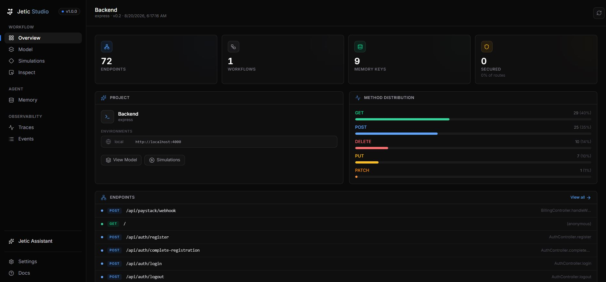
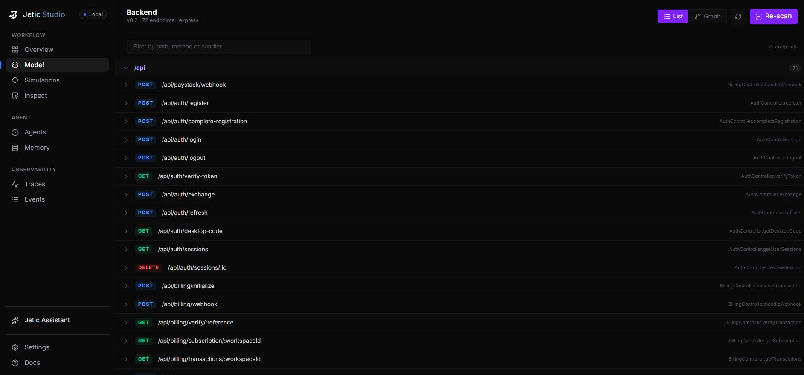
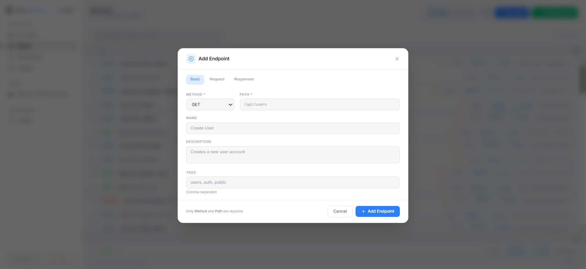
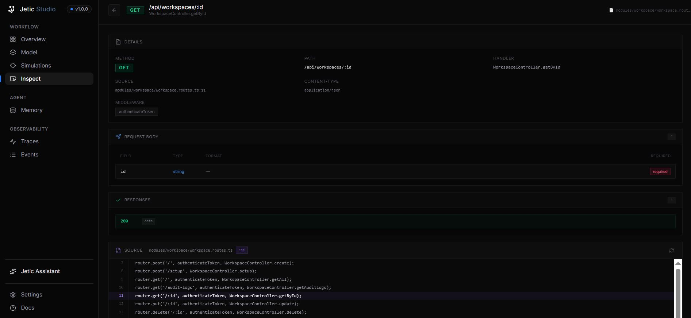
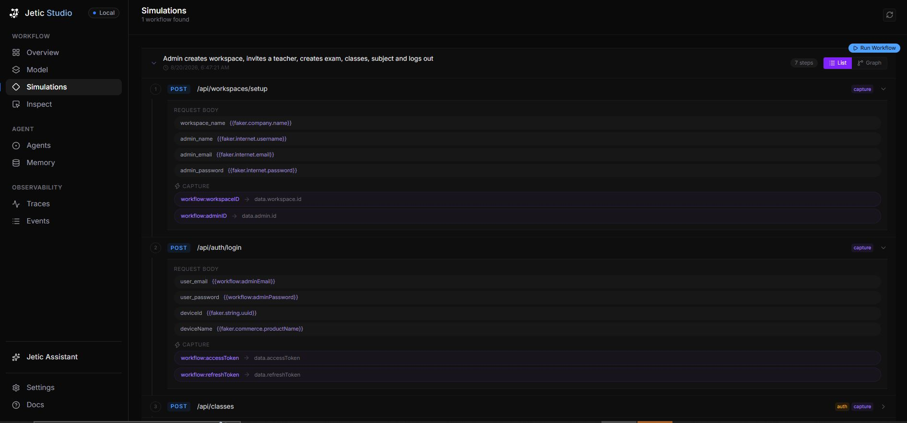
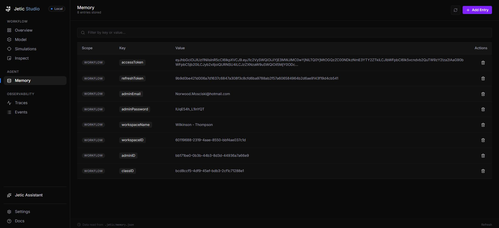
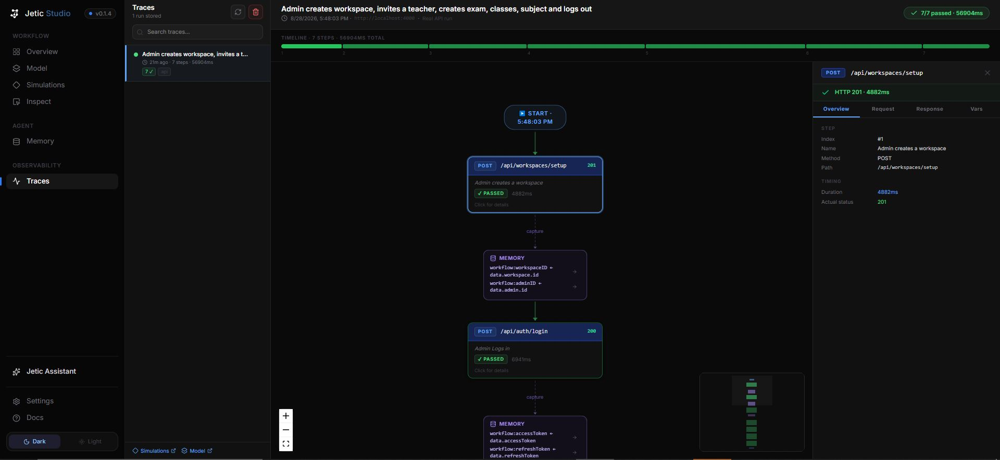

<p align="center">
  
</p>

<h1 align="center">Jetic </h1>

<p align="center">
  <strong>AI-Native API Behavior Testing, Discovery & Observability Platform — Command-Line Interface</strong>
</p>

<p align="center">
  <em>Scan backend source code → Extract behavioral models → Synthesize & run stateful AI workflows → Inspect visual traces</em>
</p>

<p align="center">
  <a href="#-key-features">Features</a> •
  <a href="#-how-jetic-works">How It Works</a> •
  <a href="#-getting-started">Getting Started</a> •
  <a href="#-cli-command-reference">CLI Reference</a> •
  <a href="#-jetic-studio-dashboard">Jetic Studio</a> •
  <a href="#-artifact--file-schemas">File Schemas</a>
</p>

<p align="center">
  <a href="https://www.npmjs.com/package/jetic-cli"></a>
  
  
  
  
</p>

---

## ⚡ The Problem

Traditional API testing tools (Postman, Insomnia, generic test runners) force developers to manually write hundreds of repetitive test scripts, hardcode authorization tokens, guess parameter validation limits, and painstakingly string together sequential operations (*Register User → Login → Save Token → Create Resource → Update Resource → Delete Resource*).

Furthermore, conventional HTTP runners only check if an endpoint returns a `200 OK`. They do **not** understand what your API is actually *supposed* to do, what business constraints govern your handlers, or how state flows across endpoint boundaries.

---

## 💡 The Jetic Solution

**`jetic-cli`** is an agentic, code-native developer platform that **automatically understands, models, simulates, and traces an application's API behavior directly from its backend source code.**

1. 🔍 **Zero-Execution Source Code Scanning**: Jetic parses your TypeScript/Express Abstract Syntax Tree (AST via `ts-morph`) without running your server. It follows imports across controllers, services, middleware, and type declarations to discover routes, parameters, validation constraints, and auth schemes.
2. 🧠 **Declarative Behavioral Graph (`model.json`)**: Generates a versioned, strongly-typed behavioral graph mapping paths, HTTP methods, request schemas, response shapes, and exact source code provenance (file + line numbers).
3. 🤖 **AI-Driven Stateful Workflow Generation**: Uses AI to synthesize multi-step, end-to-end user journeys (`.jetic/workflows/*.json`).
4. 💾 **Pre/Post State Capture & Dynamic Injection**: Captures input parameters (like faker-generated email/password) before HTTP calls and response fields (like JWT tokens and resource IDs via JSONPath) after HTTP calls into `.jetic/memory.json`, automatically injecting them into subsequent headers (e.g. `Authorization: Bearer {{workflow:accessToken}}`) or body fields.
5. 📈 **Embedded Jetic Studio Dashboard**: Serves the local developer web IDE via `jetic dev` for visual API exploration, AST source code viewing, real-time SSE workflow execution, runtime memory editing, and ReactFlow trace graph visualizer.

> [!NOTE]
> **Framework & Language Support**: Automated AST source code scanning currently supports **Node.js & Express (TypeScript)** projects.
> For backends built with other languages or frameworks (e.g., Python/FastAPI, Go, Rust, Java, NestJS), you can manually add and manage endpoints directly inside **Jetic Studio** on the **Behavioral Model** page (`/model`) using the **"Add Endpoint"** button.

---

## ✨ Key Features

- 🔍 **AST Source Discovery**: Deeply inspects Express/TypeScript source code using `ts-morph`. Recursively resolves imported controllers, services, helpers, and types up to configurable depths.
- 🧩 **Nested Router & Middleware Resolution**: Seamlessly flattens complex nested Express router chains (e.g. `app.use('/api/orders', ordersRouter)` $\rightarrow$ `router.post('/checkout')`).
- 🧠 **Constraint & Business Logic Extraction**: Extracts validation logic directly from `if` statements (e.g. `if (password.length < 8)` $\rightarrow$ `minLength: 8`) and schema definitions, enabling intelligent data generation rather than blind fuzzing.
- 🔗 **Stateful Workflow Engine**: Synthesizes and executes multi-step workflows with full variable interpolation, auto-generating dynamic test data via `@faker-js/faker`.
- 📥 **Input & Output Memory Capture**:
  - `captureInput`: Saves generated request body values (e.g. `admin_email`) to `.jetic/memory.json` *before* firing requests so subsequent steps can reuse them.
  - `capture`: Saves response JSONPath fields (e.g. `data.accessToken`, `data.workspace.id`) to `.jetic/memory.json` *after* success.
  - `inject`: Automatically injects memory values into headers (e.g. `header:Authorization = Bearer {{workflow:accessToken}}`) or body fields.
- 🖥️ **Jetic Studio Dashboard**: Modern React 19 + Vite + TailwindCSS + ReactFlow local developer web IDE (`jetic dev`) for visual API exploration, AST source code viewing, real-time SSE workflow execution, runtime memory editing, and node-graph trace debugging.
- 💻 **Feature-Rich CLI Command Suite**: Lightweight command-line interface bringing API intelligence, scanning, simulation, memory control, and config management straight to your terminal.

---

## ⚙️ How Jetic Works

```
 ┌────────────────────────┐
 │  Backend Source Code   │ (TypeScript / Express)
 └───────────┬────────────┘
             │
             ▼
 ┌────────────────────────┐
 │   packages/scanner     │ (AST parsing via ts-morph & ImportResolver)
 └───────────┬────────────┘
             │
             ▼
 ┌────────────────────────┐
 │  .jetic/model.json     │ (Behavioral Model: Endpoints, Schemas, Constraints, Auth, Source Provenance)
 └───────────┬────────────┘
             │
      ┌──────┴───────────────────────────┐
      ▼                                  ▼
┌──────────────┐             ┌────────────────────────┐
│  jetic scan  │             │  jetic simulate        │ (Single-endpoint or AI Workflows)
└──────────────┘             └───────────┬────────────┘
                                         │
                    ┌────────────────────┴───────────────────┐
                    ▼                                        ▼
      ┌─────────────────────────┐               ┌────────────────────────┐
      │  .jetic/memory.json     │               │  Jetic Studio         │
      │  (Capture & Inject State)│               │  (/traces Observability)│
      └─────────────────────────┘               └────────────────────────┘
```

1. **Scan (`jetic scan`)**: `ExpressScanner` and `ImportResolver` inspect your project root and `tsconfig.json`. They extract route paths, parameters, middleware chains, controller logic, and TypeScript types.
2. **Model (`.jetic/model.json`)**: Normalizes scanner output into a strongly typed `BehavioralModel` containing endpoint metadata, discovered constraints, expected request/response schemas, security schemes, and source references (`routes/auth.ts:42`).
3. **Synthesize Workflows (`jetic simulate workflow`)**: AI analyzes `model.json` to create end-to-end integration workflows. Step dependencies, input/output captures, and header injections are configured automatically.
4. **Run & Capture / Inject**: The simulator engine executes requests step-by-step. `captureInput` saves faker credentials pre-flight, `capture` reads response JSONPath fields post-flight, and `inject` dynamically constructs request headers/bodies for downstream steps.
5. **Trace & Observe**: Results are persisted as execution trace records and rendered in **Jetic Studio** (`/traces`) as an interactive ReactFlow node graph.

---

## 🚀 Getting Started

### Prerequisites

- **Node.js**: `v20.0.0` or higher
- **pnpm** / **npm** / **yarn**

### Installation

Install `jetic-cli` globally via npm:

```bash
npm install -g jetic-cli
```

Or run directly using `npx`:

```bash
npx jetic-cli --help
```

> [!NOTE]
> **Package Name vs Executable Command**: The CLI package is published on NPM as **`jetic-cli`** (`npm install -g jetic-cli`). Once installed, npm registers the **`jetic`** binary executable command in your system `PATH` so you can directly run `jetic init`, `jetic scan`, `jetic dev`, etc.

### Quickstart

Navigate to your TypeScript/Express backend directory:

```bash
# 1. Initialize Jetic workspace directory (.jetic/)
jetic init

# 2. Configure AI credentials for workflow generation (OpenRouter or OpenAI)
# Windows PowerShell: $env:OPENROUTER_API_KEY="your-key"
# Linux/macOS: export OPENROUTER_API_KEY="your-key"
jetic config ai --provider openrouter --model anthropic/claude-3.5-sonnet --key-env OPENROUTER_API_KEY

# 3. Scan source code and generate .jetic/model.json
jetic scan

# 4. Inspect discovered API model and AST source code provenance
jetic inspect

# 5. Run AI workflow simulation against live local backend
jetic simulate workflow --goal "Admin registers workspace, logs in, creates class and logs out"

# 6. Launch Jetic Studio local web dashboard
jetic dev
```

---

## 💻 CLI Command Reference

### `jetic init`
Initializes a `.jetic/` directory in the current working directory with a default `config.json`.

```bash
jetic init
```

---

### `jetic scan`
Parses backend source code (via `tsconfig.json` and AST resolution), extracts endpoints, schemas, constraints, and source provenance, and writes `.jetic/model.json`.

```bash
jetic scan
```

---

### `jetic inspect`
Displays summary metrics or deep inspection details for discovered API endpoints.

```bash
# Display project summary (endpoint count, methods breakdown, security rules)
jetic inspect

# Inspect a specific endpoint (shows AST source provenance, parameters, response schema)
jetic inspect endpoint GET /api/orders/:id
```

---

### `jetic simulate endpoint`
Simulates single endpoints or the entire API model against a target environment server using generated data.

```bash
# Simulate all endpoints in model.json
jetic simulate endpoint --all

# Simulate a specific endpoint with detailed response logs
jetic simulate endpoint POST /api/auth/login --verbose

# Run simulations against a specific environment defined in model.json
jetic simulate endpoint --all --env staging
```

---

### `jetic simulate workflow`
Generates and executes multi-step AI-driven workflow integration tests with automatic state capture and header injection.

```bash
# Generate and run an AI workflow for a custom natural-language goal
jetic simulate workflow --goal "User signs up, verifies email, creates project, and invites member"

# List all saved workflows in .jetic/workflows/
jetic simulate workflow --list

# Execute an existing workflow JSON file
jetic simulate workflow --workflow .jetic/workflows/user-onboarding.json

# Generate workflow JSON without running HTTP requests
jetic simulate workflow --goal "Create order and pay" --generate-only

# Clear runtime memory before executing
jetic simulate workflow --workflow .jetic/workflows/user-onboarding.json --clear-memory
```

---

### `jetic dev`
Starts the **Jetic Studio** backend API server and serves the local web dashboard interface.

```bash
# Launch Jetic Studio on default port 8787
jetic dev

# Launch Jetic Studio on a custom port
jetic dev --port 9000
```

---

### `jetic memory`
Views and manages key-value entries stored in `.jetic/memory.json`.

```bash
# List all stored memory keys and values across scopes
jetic memory list

# Get value for a key (defaults to global scope or specify scope:key)
jetic memory get workflow:accessToken

# Set a key-value entry
jetic memory set workflow:accessToken "eyJhbGciOi..."

# Delete a key
jetic memory delete workflow:accessToken

# Clear all stored memory
jetic memory clear
```

---

### `jetic config`
Configures AI providers, API key environment variables, and project settings.

```bash
# Interactively or explicitly configure AI provider settings
jetic config ai --provider openrouter --model anthropic/claude-3.5-sonnet --key-env OPENROUTER_API_KEY

# View current configuration
jetic config list
```

---

### `jetic upgrade`
Checks for updates and upgrades Jetic dependencies across the workspace.

```bash
jetic upgrade
```

---

## 🖥️ Jetic Studio Dashboard

**Jetic Studio** (`jetic dev`) is a sleek, dark-mode local web application designed specifically for visual API discovery, source provenance checking, AI workflow debugging, runtime memory control, and visual trace observability.

---

### 1. 📊 Workspace Overview (`/overview`)
The command center for your API model. Provides high-level metrics, endpoint distribution charts, security posture summaries, and quick links to recently discovered routes and workflow runs.

- **Key Highlights**: Endpoint totals, method breakdown bar, secured route percentages, recent endpoint shortcuts, active workflow list, and top memory keys preview.



---

### 2. 🧩 Behavioral Model (`/model`)
Interactive visual explorer for `.jetic/model.json`.

- **Key Highlights**: HTTP method filtering (GET, POST, PUT, DELETE, PATCH), full-text search, request/response schema inspection cards, security badges (JWT, Bearer, API Keys), middleware lists, environment switcher, and instant **Inspect** trigger buttons.
- **Manual Endpoint Creation ("Add Endpoint")**: For non-Express/TypeScript projects or custom routes, click the **"Add Endpoint"** button to manually define HTTP methods, paths, parameters, schemas, and authentication requirements directly from the interface.





---

### 3. 🔬 Endpoint Inspect (`/inspect`)
Deep-dive inspection page for any single API endpoint.

- **Key Highlights**:
  - **AST Source Code Viewer**: Live preview of the backend handler source code centered on the exact line number (e.g. `routes/orders.ts:42`).
  - **Related Files Navigator**: Automatically parses imports to show connected controllers, services, and type declaration files.
  - **Schema Explorer**: Field-by-field breakdown of request body, query parameters, path params, response definitions, and discovered constraints.
  - **Interactive REST Client**: Test live endpoints directly from the browser using real or auto-generated fake data with authorization header injection.



---

### 4. 💎 AI Workflow Simulations (`/simulations`)
Visual AI workflow builder and step-by-step runner.

- **Key Highlights**:
  - **Goal-Based Generation**: Type any prompt (e.g. *"Admin creates workspace, invites teacher, creates class, logs out"*) to synthesize full workflow graphs.
  - **SSE Live Streaming**: Watch steps execute in real time via Server-Sent Events (SSE).
  - **Payload & Injection Inspection**: Expand steps to inspect resolved body values, injected headers (`Authorization`), expected vs actual status codes, and captured variables.



---

### 5. 🗄️ Memory Inspector (`/memory`)
Real-time state and key-value store inspector for `.jetic/memory.json`.

- **Key Highlights**:
  - View authorization tokens (JWTs, session cookies), user credentials, resource IDs, and custom variables.
  - Add, edit, or delete entries across `workflow` and `global` memory scopes.
  - Clear state between simulation runs.



---

### 6. 📈 Observability & Execution Traces (`/traces`)
Interactive ReactFlow node-graph visualizer for workflow execution traces.

- **Key Highlights**:
  - **Node Graph Flow**: Visualizes steps as HTTP nodes connected by variable capture memory nodes.
  - **Timeline Bar**: Proportional duration breakdown (ms) showing step latencies and pass/fail statuses.
  - **Step Detail Drawer**: Click any node to open a side drawer detailing HTTP headers (injected vs standard), raw request body, JSON response body, expected status checks, and JSONPath capture rules.



---

## 📄 Artifact & File Schemas

### `.jetic/model.json` (Behavioral Model)

```json
{
  "version": "0.3",
  "generatedAt": "2026-08-30T10:00:00.000Z",
  "project": {
    "name": "express-shop",
    "language": "typescript",
    "framework": "express"
  },
  "environments": [
    { "name": "local", "baseUrl": "http://localhost:3000" }
  ],
  "securitySchemes": {
    "bearerAuth": {
      "type": "http",
      "scheme": "bearer",
      "obtainedFrom": {
        "endpoint": "POST /api/auth/login",
        "field": "data.accessToken"
      }
    }
  },
  "endpoints": [
    {
      "id": "post-api-auth-login",
      "method": "POST",
      "path": "/api/auth/login",
      "handlerName": "AuthController.login",
      "source": {
        "file": "src/routes/auth.routes.ts",
        "line": 14
      },
      "requestBody": {
        "contentType": "application/json",
        "fields": {
          "user_email": { "type": "string", "format": "email", "required": true },
          "user_password": { "type": "string", "minLength": 8, "required": true }
        }
      },
      "responses": {
        "200": {
          "description": "Login successful",
          "schema": {
            "data.accessToken": "string",
            "data.user.id": "string"
          }
        }
      },
      "middleware": []
    }
  ]
}
```

---

### `.jetic/workflows/admin-onboarding.json` (Workflow Definition)

```json
{
  "name": "Admin creates workspace, creates class and logs out",
  "generatedAt": "2026-08-30T10:15:00.000Z",
  "steps": [
    {
      "name": "Admin setup workspace",
      "method": "POST",
      "path": "/api/workspaces/setup",
      "description": "Register workspace and initial admin credentials",
      "body": {
        "workspace_name": "{{faker.company.name}}",
        "admin_email": "{{faker.internet.email}}",
        "admin_password": "{{faker.internet.password}}"
      },
      "captureInput": {
        "workflow:adminEmail": "admin_email",
        "workflow:adminPassword": "admin_password"
      },
      "capture": {
        "workflow:workspaceID": "data.workspace.id"
      },
      "expectStatus": 201
    },
    {
      "name": "Admin login",
      "method": "POST",
      "path": "/api/auth/login",
      "description": "Authenticate using captured admin credentials",
      "body": {
        "user_email": "{{workflow:adminEmail}}",
        "user_password": "{{workflow:adminPassword}}"
      },
      "capture": {
        "workflow:accessToken": "data.accessToken"
      },
      "expectStatus": 200
    },
    {
      "name": "Create class",
      "method": "POST",
      "path": "/api/classes",
      "description": "Create class in workspace using Bearer token",
      "inject": {
        "header:Authorization": "Bearer {{workflow:accessToken}}"
      },
      "body": {
        "name": "{{faker.word.noun}} Class",
        "workspaceId": "{{workflow:workspaceID}}"
      },
      "expectStatus": 201
    }
  ]
}
```

---

### `.jetic/memory.json` (Runtime State)

```json
{
  "workflow": {
    "adminEmail": "admin_test_8421@example.com",
    "adminPassword": "Password123!",
    "workspaceID": "ws_98124712",
    "accessToken": "eyJhbGciOiJIUzI1NiIsInR5cCI6IkpXVCJ9..."
  },
  "global": {
    "baseUrl": "http://localhost:3000"
  }
}
```

---

## 🗺️ Roadmap & Vision

- [x] **Zero-Execution AST Scanner**: Deep TypeScript/Express source parser via `ts-morph` with import resolver.
- [x] **Declarative Behavioral Modeling**: Versioned `.jetic/model.json` schema with source code line references.
- [x] **Stateful AI Workflow Engine**: Multi-step simulation generation with `captureInput`, `capture`, and `inject`.
- [x] **Jetic Studio Local Dashboard**: React 19 IDE with REST simulator, AI builder, memory editor, and ReactFlow trace visualizer (`jetic dev`).
- [ ] **State-Machine Transition Testing**: Automatic state transition verification (e.g. `payment.capture()` valid when `authorized`, invalid when `refunded`).
- [ ] **Security & Authorization Vulnerability Auditor**: Automatic IDOR (Insecure Direct Object Reference) and privilege escalation scenario synthesizer.
- [ ] **Plugin Ecosystem SDK**: Custom extensions for GraphQL, Webhooks, gRPC, and custom LLM tool-calling agent test suites.

---

## 🤝 Contributing

We welcome contributions! Please see our [CONTRIBUTING.md](../../CONTRIBUTING.md) guide for instructions on setting up your local development environment, running tests across monorepo packages, and submitting Pull Requests.

---

## 📝 License

This project is licensed under the [ISC License](../../LICENSE).

---

<p align="center">
  <i>Built with ❤️ by the Jetic Team. If you find Jetic useful, please consider giving us a ⭐ on GitHub!</i>
</p>

